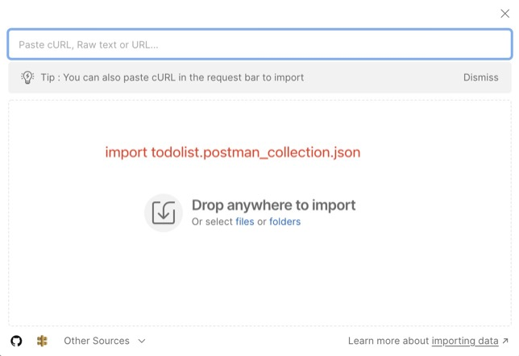
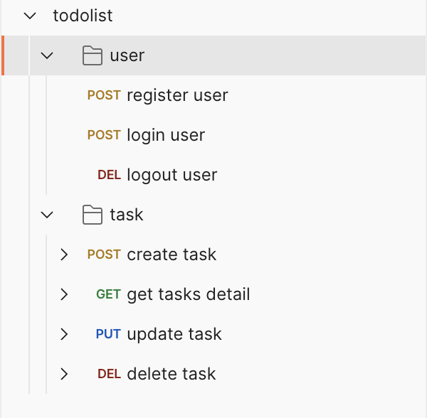

# microservice-toDoList

A golang microservice framework built upon on gin, gorm, redis, grpc, etcd. The project follows the principles of clean architecture.

redis is used to store user tokens as a caching system. gRPC is used to manage communication between the gateway and microservices. etcd is used to handle service registration and discovery.

## Main Dependencies
- gin
- gorm
- redis
- etcd
- grpc
- jwt-go
- logrus
- viper
- protobuf
## Directory Structure
Overall structure
```
├── app
│   ├── gateway
│   ├── task
│   └── user
├── config
│   ├── redis
│   └── sql
├── doc
├── global
├── pkg
│   ├── eTcd
│   ├── errmsg
│   ├── pb
│   │   ├── task_pb
│   │   └── user_pb
│   ├── resp
│   └── util
│       └── jwts
├── setting
```
Gateway structure
```
/gateway
├── cmd
├── internal
│   ├── cache
│   └── http
├── middleware
├── routes
└── rpc
```
User/Task service structure
```
/user
├── cmd
└── internal
    ├── repository
    │   ├── dao
    │   └── model
    └── service
```
## How to run
1.
```shell
docker-compose up -d
```
2.
```go
go run app/user/cmd/main.go
```
3.
```go
go run app/task/cmd/main.go
```
4.(gateway must be the final)
```go
go run app/gateway/cmd/main.go
```
## Test API
launch postman




